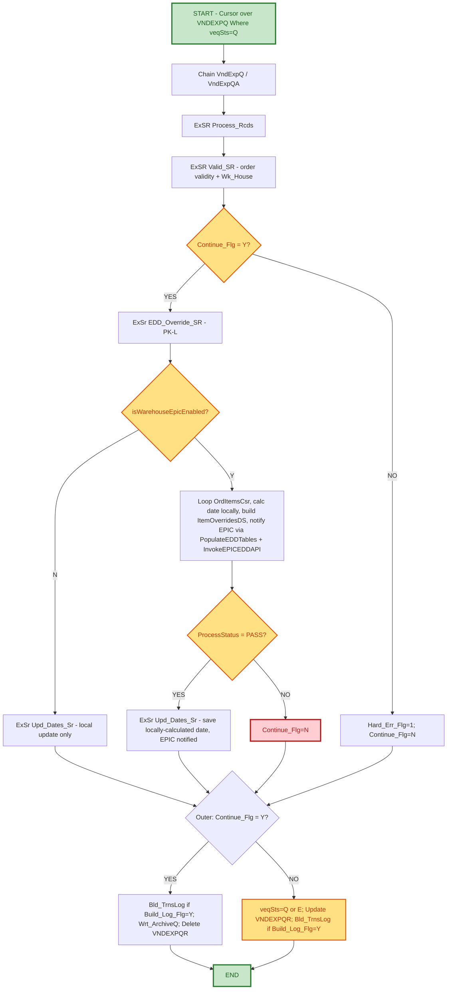

# Support Hand-Off Documentation
## Vendor Export Auto Invoicing / EPIC EDD Override (CS396H)

---

### Document Control Information

| Field | Details |
|-------|---------|
| **Project Name** | EPIC - EDD Reservation/Allocation - Build Vendor Export Auto Invoicing Records - CS396H |
| **Change Request** | CHG0053973 |
| **Jira ID** | OMS-2246 (EPIC - EDD Reservation/Allocation - Build Vendor Export Auto Invoicing Records - CS396H) |
| **Revision Level Covered** | PK-L (Approved via code review) |
| **Related Program** | CS396A (original/reference implementation) |
| **Developed by** | Prem Kumar K |
| **Date Created** | 09/15/2026 |
| **Support Hand-Off Date** | 09.22.2026 |
| **Document Version** | 1.0 |
| **Support Team** | Order Management - Primary Support |
| **Escalation Team** | Order Management / Nextuple EDD API Team |

---

## 1. PROJECT SCOPE

### 1.1 Project Overview and Business Objectives

**Program Name:** CS396H - Build Vendor Export Auto Invoicing Records, enhanced to call the Nextuple EPIC EDD (Estimated Delivery Date) service before committing local ship/delivery date overrides for 3PDS orders shipping from Epic-enabled warehouses.

**Business Purpose:**
CS396H processes queued vendor export transactions (VNDEXPQ/VNDEXPH/VNDEXPD) to build Auto-Invoicing records. For 3PDS orders shipping from an Epic-enabled warehouse (Live mode), the program now **notifies EPIC** - per line item - that these items are reserved/allocated for that warehouse with a given ship/delivery date, **before** writing that same date locally to CoMast/CoDataN/ExtOrIt. The date itself is still calculated the same way it always was (vendor-supplied `VndExpD.vedShpDt`, bumped up if the customer's requested date `ExtOrd.RqsDat` is later) - CS396H is not asking EPIC to calculate or return a date. Non-Epic-enabled (or Compare-mode) warehouses skip the EPIC notification entirely and continue to follow the pre-existing legacy flow unchanged.

**Key Business Value:**
- **Epic Awareness**: EPIC's reservation/allocation records now stay in sync with the local order dates for Epic-enabled warehouses, instead of EPIC being blind to what was sent on the vendor export.
- **Per-Item Correction**: Overrides using `ExtOrd.RqsDat` (customer requested date) when it is later than the vendor-supplied date, applied consistently across every line item of an order - same rule as before, just now also communicated to EPIC.
- **Reliable Requeue**: Genuine retry if the EPIC notification fails, instead of silently archiving/deleting the queue record as if it succeeded.

### 1.2 Key Enhancement - Revision PK-L (Functional Summary)

**In plain terms:** the program still does the same job it always did - figure out the correct ship/delivery date for each line on an order and save it. What changed is *where that date comes from* for warehouses that have gone live on Epic.

| Step | Legacy Flow (non-Epic / Compare-mode warehouse) | Epic Flow (Live-mode warehouse) |
|:-----|:------------------------------------------------|:---------------------------------|
| **1. Decide which flow applies** | Warehouse is not Epic-enabled (or is still in "Compare" testing mode) | Warehouse is confirmed Live on Epic |
| **2. Calculate the ship/delivery date** | Start with the vendor's date; if the customer requested a later date, use that instead | **Same calculation, same rule** - nothing different here |
| **3. Tell EPIC about it** | N/A - not applicable to legacy warehouses | **Notify EPIC**, per line item, that this order/item is reserved/allocated for this warehouse with the date calculated in Step 2 (an outbound override, not a date lookup) |
| **4. Save the final date** | Written to the order's date fields as before | Written to the same order date fields - the value saved is the one calculated in Step 2, unchanged by the EPIC notification |
| **5. If something goes wrong** | N/A - no external call is made | If EPIC doesn't acknowledge the notification successfully, the order is **put back in the queue to try again later** (it is not lost or marked as complete) |

**Bottom line for support:**
- The ship/delivery date is calculated the **same way in both flows** - vendor date, bumped up if the customer asked for later. EPIC does not calculate or hand back a date to us.
- The only difference for Epic-enabled warehouses is an **extra outbound step**: telling EPIC about the reservation/allocation so EPIC's records match ours.
- Legacy-flow orders are completely unaffected by this change.
- If the EPIC notification fails, the order waits and retries the notification - it doesn't lose or corrupt the date, and it doesn't error out silently.

---

## 2. PROGRAM FLOW

### 2.1 Mermaid Flow Diagram



### 2.2 Date-Correction Step (OMS-2246) - Functional Explanation

This is the shared "final date correction" step that both flows pass through before saving:

1. Go through every line item on the order, one at a time.
2. Start with the vendor-supplied ship date for that item.
3. Check if the customer requested a later date than that. If so, use the customer's requested date instead.
4. For the first item on the order, also update the order-header-level date.
5. Save the final date to the order's item and header records.

**Why this matters to support:** this step runs **identically** regardless of which flow the order came through, and it does not depend on any date returned by EPIC (EPIC is only notified - it doesn't calculate or send back a date). So if you're troubleshooting a wrong date on an order, the question to ask is "was the vendor date or customer-requested date wrong to begin with?" - not "did EPIC give us a bad date." The correction step behaves identically in both flows.

---

## 3. SUPPORT RESPONSIBILITIES

### 3.1 Primary Support Team: Order Management

**Responsibilities:**
1. ✅ Monitor VNDEXPQ for records stuck at `veqSts='Q'` beyond expected retry windows.
2. ✅ Monitor VNDEXPQ for records with `veqSts='E'` (hard error - will not auto-retry).
3. ✅ Confirm whether a stuck order is due to EPIC EDD API failures vs a hard error (missing VNDEXPH/COMAST/COPOMST record - see Section 4).
4. ✅ Escalate genuine EPIC API failures to the Nextuple EDD API team (see CS448J hand-off for API-outage evidence queries).
5. ✅ Escalate hard errors (`Hard_Err_Flg='1'/'2'/'3'`) to CODIS team.

**What Support Does NOT Do:**
- ❌ Modify CS396A/CS396H program logic.
- ❌ Manually flip `veqSts` on VNDEXPQ without confirming root cause first.
- ❌ Manually correct CoMast/CoDataN/ExtOrIt dates without dev sign-off.

### 3.2 Escalation Team: Nextuple EDD API Team

**Role:** Resolve EPIC EDD API errors/outages causing `ProcessStatus <> 'PASS'` on Epic-enabled warehouse orders.

**Escalation Required When:**
- Multiple VNDEXPQ records remain at `veqSts='Q'` for the same Epic-enabled warehouse across several job runs.
- `EDDProcResponse.ProcessStatus` is consistently non-'PASS' for that warehouse (cross-check against CS448J health-monitor incidents/evidence queries for the same time window).

---

## 4. VNDEXPQ STATUS REFERENCE

### 4.1 veqSts Values

| Value | Meaning | Support Action |
|:------|:--------|:----------------|
| `Q` | Queued/Requeued - will be picked up again on next run | Normal after PK-L EPIC-fail requeue or transient issue |
| `E` | Hard Error - will NOT auto-retry | Investigate before manual replay |
| *(row deleted)* | Success - archived to history | No action needed | these deleted rows can be found in archive tables  VNDEXPQA, VNDEXPHA, VNDEXPDA, VNDEXPTA | 

### 4.2 Distinguishing EPIC-Fail Requeue vs Hard Error

- **EPIC-fail requeue:** `IsWhseEnabled='Y'`, `EDDProcResponse.ProcessStatus <> 'PASS'`. Result: `veqSts='Q'`, `Continue_Flg='N'`, and a transaction log entry is still written for this attempt (`Bld_TrnsLog` fires).
- **Hard error:** `Hard_Err_Flg` set in `Valid_SR` (missing/invalid VNDEXPH, COMAST, or COPOMST record). Result: `veqSts='E'`. Will not requeue automatically; needs data-correction or dev review.

---

## 5. REPROCESSING / RETRY BEHAVIOR

### 5.1 On EPIC FAIL
- `IsWhseEnabled='Y'` and `ProcessStatus <> 'PASS'` → `Continue_Flg='N'` → record is requeued (`veqSts='Q'`, `Update VNDEXPQR`) and a transaction log entry is written for this attempt.
- Non-EPIC orders (`IsWhseEnabled='N'`) run `Upd_Dates_Sr` directly and are not affected by this logic.

### 5.2 On Retry After a Prior EPIC FAIL
- Each run of `Process_Rcds` re-evaluates the order independently.
- If the retry succeeds (`ProcessStatus='PASS'`), `Upd_Dates_Sr` runs, `Continue_Flg` stays `'Y'`, and the outer driver logs, archives, and deletes the record as normal.
- **Support note:** a transaction log entry is written on every pass through `Process_Rcds` - both failed and successful attempts. So for an order that fails EPIC multiple times before succeeding, expect multiple log entries for that order (one per attempt), not just one for the final success.

---

## 6. SUPPORT PROCEDURES / SQL QUERIES

**Find Stuck Requeued Records**
```sql
SELECT * FROM VNDEXPQ WHERE VEQSTS = 'Q' ORDER BY <queue timestamp/key field>;
```

**Find Hard-Error Records**
```sql
SELECT * FROM VNDEXPQ WHERE VEQSTS = 'E' ORDER BY <queue timestamp/key field>;
```

**Cross-Reference with EPIC Health Monitor (CS448J)**
Use the CS448J support hand-off (Section 5, Evidence Query) against `EDDREQHDR` for the same warehouse/time window to confirm whether a stuck CS396H record is due to a genuine EPIC API outage versus a data/hard-error issue local to CS396H/CS396A.

---

## 7. PROGRAM DEPENDENCIES

**Related/Reference Programs:**
- `CS448H` - EpicEnabledWarehouseList / `isWarehouseEpicEnabled` check.
- `CS448I` - `PopulateEDDTables` and `InvokeEPICEDDAPI` called by `EDD_Override_SR`.
- `CS448J` - EDD Service Health Monitor (see separate hand-off document) - use for confirming genuine EPIC API outages.

**Key Tables:**
- `VNDEXPQ` / `VNDEXPH` / `VNDEXPD` - Vendor export queue, header, detail.
- `COMAST` / `CODATAN` / `EXTORIT` / `EXTORD` - Order master and item-level date fields.
- 'AINVCTL' / 'INVDTL' / 'INVPREC' - Auto-invoice control/detail/price records.

---

## 8. CONTACT INFORMATION

| Level | Team | Contact | Response SLA |
|:------|:-----|:--------|:-------------|
| **L1** | Order Management Support | [Support email/queue] | 30 min (P2) |
| **L2** | Nextuple EDD API Team | [Nextuple support contact] | 1 hour (P2) |

**Original/Enhancement Developer:** Prem Kumar K

---

## Document Approval

**Document Prepared By:** Development Team
**Reviewed By:** Aarthi
**Approved By:** Aarthi
**Date:** 09.22.2026

---

**END OF SUPPORT HAND-OFF DOCUMENTATION**
