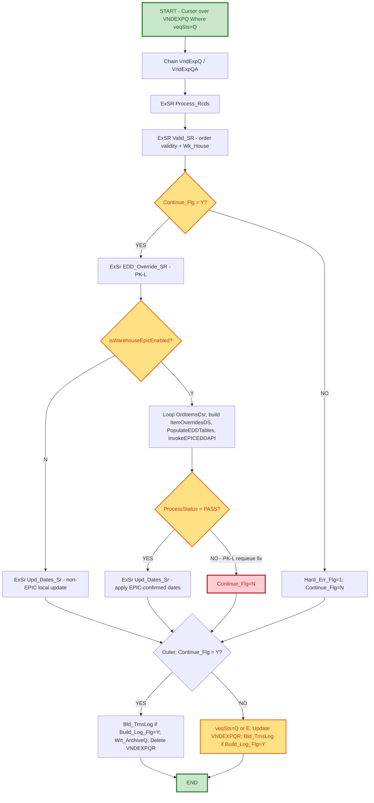

# Support Hand-Off Documentation
## Vendor Export Auto Invoicing / EPIC EDD Override (CS396H)

---

### Document Control Information

| Field | Details |
|-------|---------|
| **Project Name** | CS396H - Vendor Export Auto Invoicing (EPIC EDD Override for 3PDS Vendors) |
| **Change Request** | Task 3071 - 3PDS Vendors / EDD Override for Epic-Enabled Warehouses |
| **Jira ID** | OMS-2246 (parent EDD override integration: OMS-2243) |
| **Revision Level Covered** | PK-L (single consolidated revision - approved via code review) |
| **Related Program** | CS396A (original/reference implementation) |
| **Developed by** | Prem Kumar K |
| **Date Created** | 09/15/2026 |
| **Support Hand-Off Date** | [Fill in] |
| **Document Version** | 1.0 |
| **Support Team** | Order Management - Primary Support |
| **Escalation Team** | IBM i Development Team / Nextuple EDD API Team |

---

## 1. PROJECT SCOPE

### 1.1 Project Overview and Business Objectives

**Program Name:** CS396H - Build Vendor Export Auto Invoicing Records, enhanced to call the Nextuple EPIC EDD (Estimated Delivery Date) service before committing local ship/delivery date overrides for 3PDS orders shipping from Epic-enabled warehouses.

**Business Purpose:**
CS396H processes queued vendor export transactions (VNDEXPQ/VNDEXPH/VNDEXPD) to build Auto-Invoicing records. For 3PDS orders shipping from an Epic-enabled warehouse (Live mode), the program now calls the EPIC EDD API to obtain an authoritative ship/delivery date per line item before updating CoMast/CoDataN/ExtOrIt, instead of relying solely on the vendor-supplied `VndExpD.vedShpDt`. Non-Epic-enabled (or Compare-mode) warehouses continue to follow the pre-existing legacy date logic unchanged.

**Key Business Value:**
- **Accurate Dates**: Locally stored ship/delivery dates match what EPIC calculated for Epic-enabled warehouses, instead of drifting from raw vendor dates.
- **Per-Item Correction**: Overrides using `ExtOrd.RqsDat` (customer requested date) when it is later than the vendor/EPIC-derived date, applied consistently across every line item of an order.
- **Reliable Requeue**: Genuine retry on EPIC failure instead of silently archiving/deleting the queue record as if it succeeded.

### 1.2 Key Enhancement - Revision PK-L

Everything below was implemented, reviewed, and approved as a single consolidated revision, `PK-L` (ported/adapted from CS396A's reference implementation, tags `MR-D`/`PK-J`/`PK-K`):

1. **EDD_Override_SR (OMS-2243)**: New subroutine that checks `isWarehouseEpicEnabled(Wk_House : IsWhseEnabled : EnablementMode)`. Only `EnablementMode = 'L'` (Live) is treated as Epic-enabled; blank/Compare mode falls back to `IsWhseEnabled='N'` (legacy flow). When enabled, loops `OrdItemsCsr` over `CODATAN`, builds `ItemOverridesDS`/`LineItemSeqArr`, calls `PopulateEDDTables` then `InvokeEPICEDDAPI`, and captures the result in `EDDProcResponse.ProcessStatus`.

2. **Upd_Dates_Sr (OMS-2246, renamed from the earlier `Abc_Sr` working name)**: Adds `Wk_RqsDat` (Packed 8:0) and pulls the `ExtOrd.RqsDat` vs `vedShpDt` comparison out of the `Hld_Order` (order-level) guard so it runs once **per line item** instead of only for the first item of the transaction (mirrors the same fix applied in CS396A). Uses `%DATE(%Char(Wk_RqsDat):*ISO0)` since `ExtOrd.RqsDat` is CCYYMMDD packed numeric.

3. **Requeue fix in `Process_Rcds`**: On genuine EPIC failure (`IsWhseEnabled='Y'` and `EDDProcResponse.ProcessStatus <> 'PASS'`), sets `Continue_Flg = 'N'`. Without this, `Continue_Flg` stayed `'Y'` and the outer driver archived/deleted `VNDEXPQR` right after `Process_Rcds`, wiping out the intended `'Q'` (requeue) status. Guarded to `IsWhseEnabled='Y'` only, so the non-EPIC warehouse flow (`ExSr Upd_Dates_Sr` still runs directly) is not disturbed. **Note:** `Build_Log_Flg` is intentionally left unchanged by this fix - see Section 5.

---

## 2. PROGRAM FLOW

### 2.1 Mermaid Flow Diagram



### 2.2 Upd_Dates_Sr (OMS-2246) Detail

```
Loop CoDatNA1 by (copCusOrdN : vedItmNo)
  Save WK_VedShpDt = vedShpDt
  PK-L: Chain(n) ExtOrd by copCusOrdN; If RqsDat > vedShpDt (as *ISO0), bump vedShpDt = RqsDat
        (runs every item - NOT gated by Hld_Order)
  If Hld_Order <> copCusOrdN (first item of order only): update CoMast (CO_RqDte/CO_MSDte)
  Update CoDataCN / EXTORIT with corrected date
```

This subroutine runs in **both** flows: directly when `IsWhseEnabled='N'` (legacy/non-Epic), and after a `PASS` EPIC response when `IsWhseEnabled='Y'`.

---

## 3. SUPPORT RESPONSIBILITIES

### 3.1 Primary Support Team: Order Management

**Responsibilities:**
1. ✅ Monitor VNDEXPQ for records stuck at `veqSts='Q'` beyond expected retry windows.
2. ✅ Monitor VNDEXPQ for records with `veqSts='E'` (hard error - will not auto-retry).
3. ✅ Confirm whether a stuck order is due to EPIC EDD API failures vs a hard error (missing VNDEXPH/COMAST/COPOMST record - see Section 4).
4. ✅ Escalate genuine EPIC API failures to the Nextuple EDD API team (see CS448J hand-off for API-outage evidence queries).
5. ✅ Escalate hard errors (`Hard_Err_Flg='1'/'2'/'3'`) to IBM i Development Team.

**What Support Does NOT Do:**
- ❌ Modify CS396A/CS396H program logic.
- ❌ Manually flip `veqSts` on VNDEXPQ without confirming root cause first.
- ❌ Manually correct CoMast/CoDataN/ExtOrIt dates without dev sign-off.

### 3.2 Escalation Team: Nextuple EDD API Team

**Role:** Resolve EPIC EDD API errors/outages causing `ProcessStatus <> 'PASS'` on Epic-enabled warehouse orders.

**Escalation Required When:**
- Multiple VNDEXPQ records remain at `veqSts='Q'` for the same Epic-enabled warehouse across several job runs.
- `EDDProcResponse.ProcessStatus` is consistently non-'PASS' for that warehouse (cross-check against CS448J health-monitor incidents/evidence queries for the same time window).

---

## 4. VNDEXPQ STATUS REFERENCE

### 4.1 veqSts Values

| Value | Meaning | Support Action |
|:------|:--------|:----------------|
| `Q` | Queued/Requeued - will be picked up again on next run | Normal after PK-L EPIC-fail requeue or transient issue |
| `E` | Hard Error - will NOT auto-retry | Investigate before manual replay |
| *(row deleted)* | Success - archived to history | No action needed |

### 4.2 Distinguishing EPIC-Fail Requeue vs Hard Error

- **EPIC-fail requeue (PK-L):** `IsWhseEnabled='Y'`, `EDDProcResponse.ProcessStatus <> 'PASS'`. `veqSts='Q'`, `Continue_Flg='N'`. `Build_Log_Flg` is left as-is (normally `'Y'`), so `Bld_TrnsLog` still fires for this failed attempt - see Section 5.
- **Hard error:** `Hard_Err_Flg` set in `Valid_SR` (missing/invalid VNDEXPH, COMAST, or COPOMST record). `veqSts='E'`. Will not requeue automatically; needs data-correction or dev review.

---

## 5. REPROCESSING / RETRY BEHAVIOR (PK-L)

### 5.1 On EPIC FAIL
- `Continue_Flg` is forced to `'N'` only for `IsWhseEnabled='Y'` AND `ProcessStatus <> 'PASS'`. Without this, `Continue_Flg` stayed `'Y'` and the outer driver archived/deleted `VNDEXPQR` immediately after `Process_Rcds`, silently losing the failed transaction instead of requeuing it.
- `Build_Log_Flg` is **not** modified by this fix - it is still whatever was set before `ExSR Process_Rcds` (normally `'Y'`). So the outer driver's `Else` branch (`veqSts='Q'`; `Update VNDEXPQR`) still runs `Bld_TrnsLog` for this failed attempt, i.e. **the failed attempt IS logged**.
- Non-EPIC orders (`IsWhseEnabled='N'`) are unaffected - they run `Upd_Dates_Sr` directly and never touch `Continue_Flg` in this branch.

### 5.2 On Retry After a Prior EPIC FAIL
- `Continue_Flg` is a transient working variable re-derived fresh every run (`Valid_SR` sets it back to `'Y'`); a prior failed pass has no effect on the next pass.
- If the retry succeeds (`ProcessStatus='PASS'`), `Upd_Dates_Sr` runs, `Continue_Flg` stays `'Y'` - the outer driver takes the success branch: `Bld_TrnsLog` (log fires again), `Wrt_ArchiveQ`, `Delete VNDEXPQR`.
- **Net effect:** because `Build_Log_Flg` is untouched, **every** attempt (failed or successful) produces a transaction log entry - one log entry per pass through `Process_Rcds`, not just the final successful one. This is different from suppressing logs on failure; confirm with the business/reviewer whether duplicate log entries per retry are acceptable, since each failed EPIC attempt on the same VNDEXPQ row will log again on every job run until it eventually passes.

---

## 6. SUPPORT PROCEDURES / SQL QUERIES

**Find Stuck Requeued Records**
```sql
SELECT * FROM VNDEXPQ WHERE VEQSTS = 'Q' ORDER BY <queue timestamp/key field>;
```

**Find Hard-Error Records**
```sql
SELECT * FROM VNDEXPQ WHERE VEQSTS = 'E' ORDER BY <queue timestamp/key field>;
```

**Cross-Reference with EPIC Health Monitor (CS448J)**
Use the CS448J support hand-off (Section 5, Evidence Query) against `EDDREQHDR` for the same warehouse/time window to confirm whether a stuck CS396H record is due to a genuine EPIC API outage versus a data/hard-error issue local to CS396H/CS396A.

---

## 7. PROGRAM DEPENDENCIES

**Related/Reference Programs:**
- `CS396A` - Original vendor export program with the reference implementation (tags MR-D, PK-J, PK-K) that CS396H's consolidated `PK-L` changes were ported from.
- `CS448H` - EpicEnabledWarehouseList / `isWarehouseEpicEnabled` check.
- `CS448J` - EDD Service Health Monitor (see separate hand-off document) - use for confirming genuine EPIC API outages.

**Key Tables:**
- `VNDEXPQ` / `VNDEXPH` / `VNDEXPD` - Vendor export queue, header, detail.
- `COMAST` / `CODATAN` / `EXTORIT` / `EXTORD` - Order master and item-level date fields.

---

## 8. CONTACT INFORMATION

| Level | Team | Contact | Response SLA |
|:------|:-----|:--------|:-------------|
| **L1** | Order Management Support | [Support email/queue] | 30 min (P2) |
| **L2** | Nextuple EDD API Team | [Nextuple support contact] | 1 hour (P2) |
| **L3** | IBM i Development Team | [Dev team contact] | 2 hours (P2) |

**Original/Enhancement Developer:** Prem Kumar K

---

## Document Approval

**Document Prepared By:** Development Team
**Reviewed By:** [Name]
**Approved By:** [Name]
**Date:** [Fill in]

---

**END OF SUPPORT HAND-OFF DOCUMENTATION**
