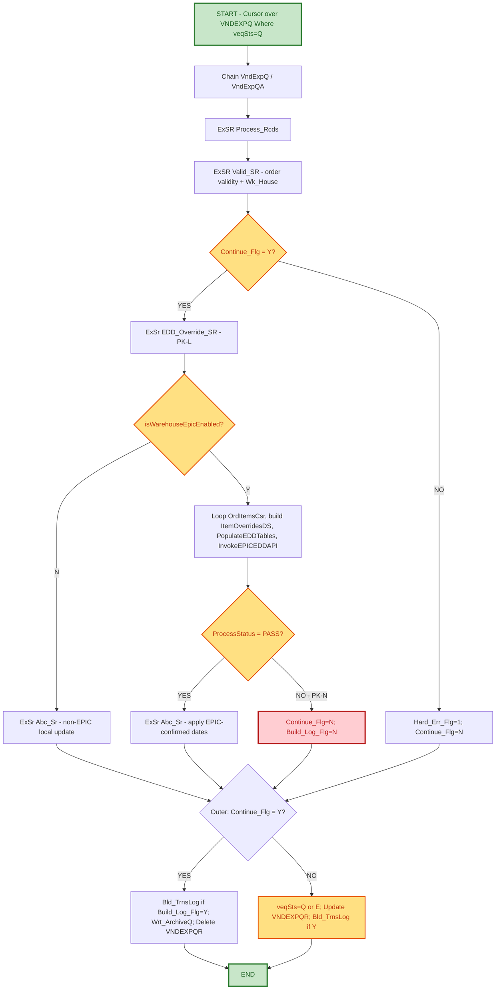

# Support Hand-Off Documentation
## Vendor Export / EPIC EDD Auto-PO Override (CS396H)

---

### Document Control Information

| Field | Details |
|-------|---------|
| **Project Name** | CS396H - Vendor Export (EPIC EDD Auto-PO Override) |
| **Change Request** | Task 3071 - Epic - EDD Auto PO Changes UTC |
| **Jira ID** | OMS-2246 (parent EDD override integration: OMS-2243) |
| **Revision Levels Covered** | PK-L, PK-M, PK-N (ported from CS396A tags MR-D, PK-J, PK-K) |
| **Related Program** | CS396A (original/reference implementation) |
| **Developed by** | Prem Kumar K |
| **Date Created** | [Fill in] |
| **Support Hand-Off Date** | [Fill in] |
| **Document Version** | 1.0 |
| **Support Team** | Order Management - Primary Support |
| **Escalation Team** | IBM i Development Team / Nextuple EDD API Team |

---

## 1. PROJECT SCOPE

### 1.1 Project Overview and Business Objectives

**Program Name:** CS396H - Vendor Export processing program (Auto-Invoicing), enhanced to call the Nextuple EPIC EDD (Estimated Delivery Date) service before committing local ship/delivery date overrides for Epic-enabled warehouses.

**Business Purpose:**
CS396H processes queued vendor export transactions (VNDEXPQ/VNDEXPH/VNDEXPD). For orders shipping from an Epic-enabled warehouse, the program now calls the EPIC EDD API to obtain an authoritative ship/delivery date per line item before updating CoMast/CoDataN/ExtOrIt, instead of relying solely on the vendor-supplied `VndExpD.vedShpDt`.

**Key Business Value:**
- **Accurate Dates**: Locally stored ship/delivery dates match what EPIC calculated for Epic-enabled warehouses, instead of drifting from raw vendor dates.
- **Per-Item Correction**: Overrides using `ExtOrd.RqsDat` (customer requested date) when it is later than the vendor/EPIC-derived date, applied consistently across every line item of an order.
- **Reliable Requeue**: Genuine retry on EPIC failure instead of silently archiving/deleting the queue record as if it succeeded.

### 1.2 Key Enhancement Tags in This Program

1. **PK-L**: Ported `EDD_Override_SR` (OMS-2243) and `Abc_Sr` (OMS-2246) EPIC integration from CS396A (originally tagged MR-D/PK-J/PK-K there). Adds `isWarehouseEpicEnabled` check, `ItemOverridesDS`/`LineItemSeqArr` population, `PopulateEDDTables` + `InvokeEPICEDDAPI` calls, and `EDDProcResponse` gating of `Abc_Sr`.

2. **PK-M**: Adds `Wk_RqsDat` (Packed 8:0) and pulls the `ExtOrd.RqsDat` vs `vedShpDt` comparison out of the `Hld_Order` (order-level) guard inside `Abc_Sr` so it runs once **per line item** instead of only for the first item of the transaction (mirrors the same fix applied in CS396A's `Upd_Dates_SR`). Uses `%DATE(Wk_RqsDat:*ISO0)` since `ExtOrd.RqsDat` is CCYYMMDD packed numeric.

3. **PK-N**: Fixes the EPIC-FAIL requeue path in `Process_Rcds`. Previously, on EPIC FAIL the code set `veqSts='Q'` and updated `VNDEXPQ`, but never changed `Continue_Flg`, so the outer driver still took the success branch (archive + Delete VNDEXPQR) immediately afterward - erasing the 'Q' status and silently losing the requeue. PK-N sets `Continue_Flg='N'` and `Build_Log_Flg='N'` **only** on the genuine EPIC-fail branch (`IsWhseEnabled='Y'` and `EDDProcResponse.ProcessStatus <> 'PASS'`), so the outer driver takes the correct retry branch (real `veqSts='Q'` update, row survives) without disturbing the non-EPIC (`IsWhseEnabled='N'`) flow.

---

## 2. PROGRAM FLOW

### 2.1 Mermaid Flow Diagram



### 2.2 Abc_Sr (OMS-2246) Detail

```
Loop CoDatNA1 by (copCusOrdN : vedItmNo)
  Save WK_VedShpDt = vedShpDt
  PK-M: Chain(n) ExtOrd by copCusOrdN; If RqsDat > vedShpDt (as *ISO0), bump vedShpDt = RqsDat
        (runs every item - NOT gated by Hld_Order)
  If Hld_Order <> copCusOrdN (first item of order only): update CoMast (CO_RqDte/CO_MSDte)
  Update CoDataCN / EXTORIT with corrected date
```

---

## 3. SUPPORT RESPONSIBILITIES

### 3.1 Primary Support Team: Order Management

**Responsibilities:**
1. ✅ Monitor VNDEXPQ for records stuck at `veqSts='Q'` beyond expected retry windows.
2. ✅ Monitor VNDEXPQ for records with `veqSts='E'` (hard error - will not auto-retry).
3. ✅ Confirm whether a stuck order is due to EPIC EDD API failures vs a hard error (missing VNDEXPH/COMAST/COPOMST record - see Section 4).
4. ✅ Escalate genuine EPIC API failures to the Nextuple EDD API team (see CS448J hand-off for API-outage evidence queries).
5. ✅ Escalate hard errors (`Hard_Err_Flg='1'/'2'/'3'`) to IBM i Development Team.

**What Support Does NOT Do:**
- ❌ Modify CS396A/CS396H program logic.
- ❌ Manually flip `veqSts` on VNDEXPQ without confirming root cause first.
- ❌ Manually correct CoMast/CoDataN/ExtOrIt dates without dev sign-off.

### 3.2 Escalation Team: Nextuple EDD API Team

**Role:** Resolve EPIC EDD API errors/outages causing `ProcessStatus <> 'PASS'` on Epic-enabled warehouse orders.

**Escalation Required When:**
- Multiple VNDEXPQ records remain at `veqSts='Q'` for the same Epic-enabled warehouse across several job runs.
- `EDDProcResponse.ProcessStatus` is consistently non-'PASS' for that warehouse (cross-check against CS448J health-monitor incidents/evidence queries for the same time window).

---

## 4. VNDEXPQ STATUS REFERENCE

### 4.1 veqSts Values

| Value | Meaning | Support Action |
|:------|:--------|:----------------|
| `Q` | Queued/Requeued - will be picked up again on next run | Normal after PK-N requeue or transient issue |
| `E` | Hard Error - will NOT auto-retry | Investigate before manual replay |
| *(row deleted)* | Success - archived to history | No action needed |

### 4.2 Distinguishing EPIC-Fail Requeue vs Hard Error

- **EPIC-fail requeue (PK-N):** `IsWhseEnabled='Y'`, `EDDProcResponse.ProcessStatus <> 'PASS'`. `veqSts='Q'`, `Continue_Flg='N'`, `Build_Log_Flg='N'` (no log entry for the failed attempt; a later successful retry logs normally - see Section 5).
- **Hard error:** `Hard_Err_Flg` set in `Valid_SR` (missing/invalid VNDEXPH, COMAST, or COPOMST record). `veqSts='E'`. Will not requeue automatically; needs data-correction or dev review.

---

## 5. REPROCESSING / RETRY BEHAVIOR (PK-N)

### 5.1 On EPIC FAIL
- `Continue_Flg` forced to `'N'` and `Build_Log_Flg` forced to `'N'` only for `IsWhseEnabled='Y'` AND `ProcessStatus <> 'PASS'`.
- Outer driver takes the normal `veqSts='Q'` / Update VNDEXPQR path (row preserved) and skips `Bld_TrnsLog` for this failed attempt.
- Non-EPIC orders (`IsWhseEnabled='N'`) are unaffected by PK-N.

### 5.2 On Retry After a Prior EPIC FAIL
- `Build_Log_Flg`/`Continue_Flg` are transient working variables re-derived fresh every run; a prior failed pass has no effect on the next pass.
- If the retry succeeds (`ProcessStatus='PASS'`), `Abc_Sr` runs, `Continue_Flg` stays `'Y'`, `Build_Log_Flg` is `'Y'` as normally set - so the successful retry **is logged**, then archived and deleted as usual.
- **Net effect:** exactly one transaction log entry for the eventual successful attempt; failed attempts are not logged and do not leave orphaned VNDEXPQ rows.

---

## 6. SUPPORT PROCEDURES / SQL QUERIES

**Find Stuck Requeued Records**
```sql
SELECT * FROM VNDEXPQ WHERE VEQSTS = 'Q' ORDER BY <queue timestamp/key field>;
```

**Find Hard-Error Records**
```sql
SELECT * FROM VNDEXPQ WHERE VEQSTS = 'E' ORDER BY <queue timestamp/key field>;
```

**Cross-Reference with EPIC Health Monitor (CS448J)**
Use the CS448J support hand-off (Section 5, Evidence Query) against `EDDREQHDR` for the same warehouse/time window to confirm whether a stuck CS396H record is due to a genuine EPIC API outage versus a data/hard-error issue local to CS396H/CS396A.

---

## 7. PROGRAM DEPENDENCIES

**Related/Reference Programs:**
- `CS396A` - Original vendor export program with the reference implementation (tags MR-D, PK-J, PK-K) that CS396H's PK-L/PK-M/PK-N changes were ported from.
- `CS448H` - EpicEnabledWarehouseList / `isWarehouseEpicEnabled` check.
- `CS448J` - EDD Service Health Monitor (see separate hand-off document) - use for confirming genuine EPIC API outages.

**Key Tables:**
- `VNDEXPQ` / `VNDEXPH` / `VNDEXPD` - Vendor export queue, header, detail.
- `COMAST` / `CODATAN` / `EXTORIT` / `EXTORD` - Order master and item-level date fields.

---

## 8. CONTACT INFORMATION

| Level | Team | Contact | Response SLA |
|:------|:-----|:--------|:-------------|
| **L1** | Order Management Support | [Support email/queue] | 30 min (P2) |
| **L2** | Nextuple EDD API Team | [Nextuple support contact] | 1 hour (P2) |
| **L3** | IBM i Development Team | [Dev team contact] | 2 hours (P2) |

**Original/Enhancement Developer:** Prem Kumar K

---

## Document Approval

**Document Prepared By:** Development Team
**Reviewed By:** [Name]
**Approved By:** [Name]
**Date:** [Fill in]

---

**END OF SUPPORT HAND-OFF DOCUMENTATION**
